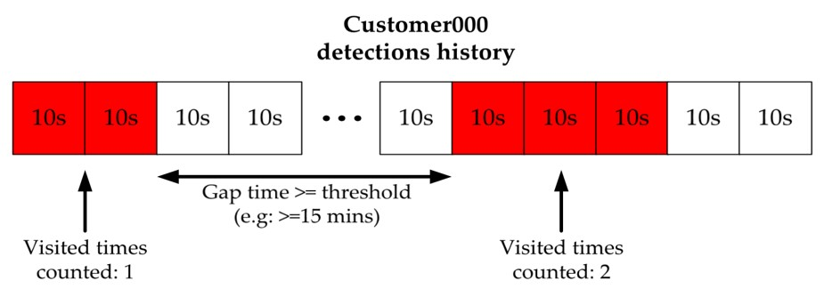

#### Example query
```js
// example
SELECT col1, col2 FROM db WHERE visitor_id LIKE '%_M' ORDER BY timestamp ASC


// Retrieve all masked visitors data with client_id = new_test_v1
SELECT visitor_id, img_str, timestamp FROM new_test_v1_uvdb WHERE visitor_id LIKE '%_M' ORDER BY timestamp ASC


```
###### Retrieve visitors data from specific day
```js
SELECT visitor_id, img_str, timestamp FROM new_test_v1_uvdb WHERE timestamp LIKE '20210427-%' ORDER BY timestamp ASC
```
###### Retrieve specific visitor data from specific day
```js
SELECT img_str, timestamp FROM new_test_v1_uvdb WHERE visitor_id="visitor_000_M" AND timestamp LIKE '20210427-%' ORDER BY timestamp ASC
```
###### Retrieve list of unique masked visitor_id from database
```js
SELECT DISTINCT(visitor_id) FROM new_test_v1_uvdb WHERE visitor_id LIKE '%_M'
``` 
###### Note: visit_times today and this week need to be calculate in client side based on visit_gap_time and retrieved timestamps from specific days


<head>
<meta name="viewport" content="width=device-width, initial-scale=1">
<style>
img {
  display: block;
  margin-left: auto;
  margin-right: auto;
}
</style>
</head>

```js
```


<head>
<meta name="viewport" content="width=device-width, initial-scale=1">
<style>
img {
  display: block;
  margin-left: auto;
  margin-right: auto;
}
</style>
</head>

```js
```

###### Create known visitor table
```js
CREATE TABLE IF NOT EXISTS new_test_v1_kv_manual (visitor_id VARCHAR(50),img_str TEXT)
```

###### Manually add known visitor information to table
```js
INSERT INTO new_test_v1_kv_manual (visitor_id,img_str) VALUES ("Pham_Tung_Lam", "Base64EncodedString")
```