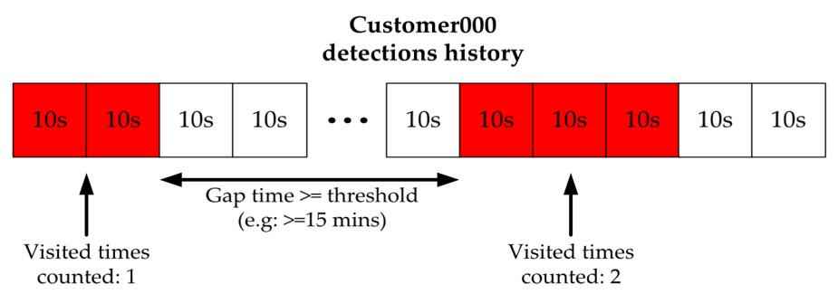
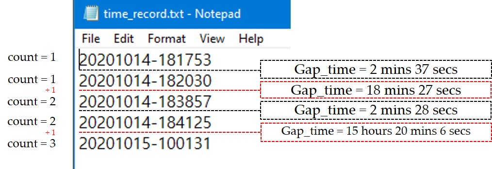

#### Example query
```js
Note: visit_times today and this week need to be calculate in client side,
based on visit_gap_time and retrieved timestamps from specific days

```

<head>
<meta name="viewport" content="width=device-width, initial-scale=1">
<style>
img {
  display: block;
  margin-left: auto;
  margin-right: auto;
}
</style>
</head>

```js
```


<head>
<meta name="viewport" content="width=device-width, initial-scale=1">
<style>
img {
  display: block;
  margin-left: auto;
  margin-right: auto;
}
</style>
</head>

```js


```

###### Create known visitor table
```js
CREATE TABLE IF NOT EXISTS new_test_v1_kv_manual (visitor_id VARCHAR(50),img_str TEXT)
```

###### Manually add known visitor information to table
```js
INSERT INTO new_test_v1_kv_manual (visitor_id,img_str) VALUES ("Pham_Tung_Lam", "Base64EncodedString")
```